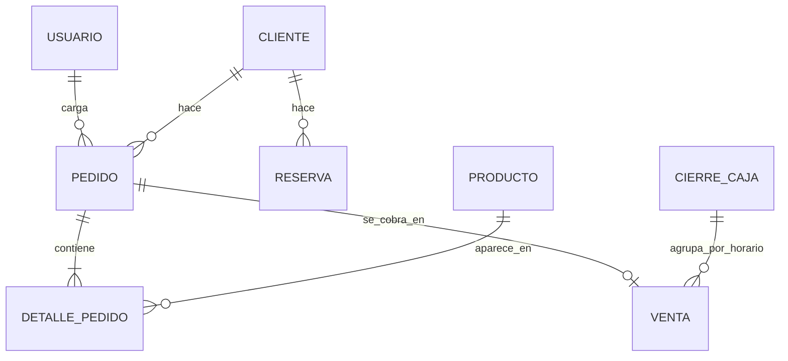

# Gestor Gastronómico — Backend

API REST para la gestión de un bar o restaurante: pedidos (mesa, retiro y delivery), cocina, cobros y caja, reservas, menú, usuarios por rol y configuración del local.

Lo usan dos clientes web:

- **Página pública** (`index_bar.html`): el cliente arma su pedido o reserva.
- **Panel** (`panel_bar.html`): el personal trabaja con los pedidos, la cocina, la caja y la configuración.

## Tecnologías

| Capa | Herramienta |
|---|---|
| Lenguaje | Java 21 |
| Framework | Spring Boot 3.2 (Web, Data JPA, Security, Validation, WebSocket) |
| Base de datos | MySQL 8 |
| Autenticación | JWT (sin sesión en el servidor) |
| Documentación de la API | springdoc-openapi (`/swagger-ui/index.html`, solo admin) |
| Pruebas | JUnit 5, Mockito, Spring Security Test, JaCoCo |
| Despliegue | Docker en Railway; CI con GitHub Actions |

## Arquitectura

```
controller  →  service  →  repository  →  MySQL
    ↑             ↑
   dto        entity / reglas de negocio
```

- **controller**: recibe el pedido HTTP, valida el DTO y delega. No tiene reglas de negocio.
- **service**: reglas del negocio (estados del pedido, horarios, caja, permisos por dueño del pedido).
- **repository**: acceso a datos con Spring Data JPA.
- **config**: seguridad, JWT, reloj, Jackson, tareas al arrancar.
- **exception**: errores de negocio y su traducción a respuestas HTTP con mensaje claro.

La hora se toma de un `Clock` inyectable (zona `America/Argentina/Buenos_Aires`), así las pruebas pueden fijar el momento.

## Roles

| Rol | Puede |
|---|---|
| ADMIN | Todo: configuración, usuarios, copias de seguridad, anular ventas. |
| CAJERO | Pedidos, cobros y caja, reservas, clientes y menú. |
| COCINA | Ver pedidos activos y avanzar su estado (preparación, listo). |
| MOZO | Cargar y editar los pedidos de sus mesas. |
| Cliente (sin cuenta) | Ver el menú, hacer pedidos y reservas desde la web. |

## Requerimientos

### Funcionales

| Código | Requerimiento |
|---|---|
| RF01 | El cliente arma un pedido para retiro o delivery desde la web, eligiendo horario y medio de pago. |
| RF02 | El cliente reserva mesa indicando fecha, hora y cantidad de personas, dentro del horario de atención. |
| RF03 | El personal carga pedidos de mesa, retiro o delivery desde el panel. |
| RF04 | Cocina ve los pedidos pendientes y en preparación y los marca como listos. |
| RF05 | El cajero cobra un pedido (antes o después de prepararlo) y lo entrega. |
| RF06 | El sistema registra cada cobro en la caja abierta; la caja se abre y se cierra con su total. |
| RF07 | Un cobro mal cargado se puede corregir dejando registro del cambio. |
| RF08 | El administrador consulta un informe de ventas por período y lo exporta a Excel. |
| RF09 | El personal gestiona las reservas: crear, editar, cancelar, marcar llegada o ausencia. |
| RF10 | El administrador gestiona el menú, los usuarios y la configuración del local (horarios, envío, medios de pago, límites de reservas, apariencia). |
| RF11 | El panel avisa en tiempo real cuando entra un pedido o una reserva, y al mozo cuando su pedido está listo. |
| RF12 | El sistema hace copias de seguridad automáticas de la base y permite descargar una al momento. |

### No funcionales

| Código | Requerimiento |
|---|---|
| RNF01 | Seguridad: contraseñas con BCrypt, JWT con clave por variable de entorno, permisos por rol en cada endpoint, bloqueo por intentos fallidos. |
| RNF02 | Integridad: los montos se calculan en el servidor y se redondean al peso hacia arriba con `BigDecimal`. |
| RNF03 | Usabilidad: mensajes de error en castellano que dicen qué corregir; el panel funciona en celular. |
| RNF04 | Disponibilidad: si el WebSocket se corta, el panel sigue actualizándose por consulta periódica. |
| RNF05 | Mantenibilidad: capas separadas, pruebas automáticas en cada push, configuración por variables de entorno. |
| RNF06 | Rendimiento: la configuración pública se sirve con ETag y una versión sin imágenes para los refrescos. |

## Casos de uso principales

| Caso de uso | Actor | Flujo principal |
|---|---|---|
| CU01 Hacer pedido web | Cliente | Elige productos → tipo de entrega → horario → datos → confirma → ve el resumen con el número de pedido. |
| CU02 Reservar mesa | Cliente / Cajero | Elige fecha y hora → personas → datos → el sistema valida horario y cupo → confirma. |
| CU03 Preparar pedido | Cocina | Ve el pedido pendiente → lo pasa a preparación → lo marca listo (puede deshacerlo). |
| CU04 Cobrar pedido | Cajero | Abre el cobro → elige medio de pago → ingresa con cuánto paga → confirma (entrega ahora o deja el pedido en cocina como PAGADO). |
| CU05 Cerrar caja | Cajero / Admin | Ve el total de la caja → confirma → la caja queda guardada en Movimientos. |
| CU06 Corregir cobro | Cajero / Admin | Abre el detalle de la caja → elige el medio correcto → queda registrado el original. |
| CU07 Configurar el local | Admin | Edita datos, horarios, envío, pagos y límites → el sistema valida → guarda. |

## Lista de eventos

| Evento | Origen | Respuesta del sistema |
|---|---|---|
| Cliente confirma un pedido | Web | Valida horario, entrega y pago; calcula el total; avisa al panel. |
| Cliente pide una reserva | Web | Valida horario y cupo del turno; avisa al panel. |
| Cocina cambia el estado | Panel | Valida la transición; avisa a los demás paneles y al mozo. |
| Cajero cobra | Panel | Crea la venta en la caja abierta; entrega el pedido o lo deja pagado. |
| Se cierra la caja | Panel | Guarda el cierre con total y cantidad de ventas. |
| Llega la hora de la copia | Reloj | Ejecuta `mysqldump` y borra las copias más viejas que la retención. |

## Modelo de datos



| Entidad | Datos principales |
|---|---|
| Pedido | fecha, hora, estado (PENDIENTE, PREPARACION, LISTO, ENTREGADO, CANCELADO), tipo (LOCAL, RETIRO, DELIVERY), mesa, horario de entrega, costo de envío, total |
| DetallePedido | producto, opción elegida, cantidad, precio unitario, subtotal |
| Venta | fecha, hora, jornada, total, medio de pago (y el original si se corrigió) |
| Reserva | fecha, hora, personas, teléfono, estado (CONFIRMADA, CANCELADA, COMPLETADA), no asistió |
| CierreCaja | apertura, cierre, total y cantidad de ventas |
| ConfigLocal | datos del local, turnos, delivery, medios de pago, límites de reservas, apariencia |

## Cómo correrlo

Requisitos: JDK 21, Maven 3.9 y MySQL 8.

```bash
# variables mínimas (o cargalas en la configuración de ejecución de IntelliJ)
export DB_PASSWORD=tu_clave_de_mysql
export JWT_SECRET=una_clave_larga_de_al_menos_32_caracteres

mvn spring-boot:run
```

La base `gestor_gastronomico_db` se crea sola. Con la base vacía se crean usuarios de ejemplo (uno por rol) y un plato de ejemplo; mientras sigan las contraseñas de fábrica, el log lo avisa al arrancar.

### Variables de entorno

| Variable | Para qué | Por defecto |
|---|---|---|
| `DB_URL`, `DB_USER`, `DB_PASSWORD` | Conexión a MySQL | localhost, `root`, sin clave |
| `JWT_SECRET` | Firma de las sesiones | clave aleatoria en cada arranque |
| `MASTER_KEY` | Recuperar contraseñas desde el login | desactivado |
| `BACKUP_ENABLED`, `BACKUP_CRON`, `BACKUP_DIR`, `BACKUP_RETENTION_DAYS` | Copias de seguridad | activado, cada 3 h, `backups`, 14 días |

## Pruebas

```bash
mvn verify
```

Corre las pruebas y genera el informe de cobertura en `target/site/jacoco/index.html`.

- **Unitarias** (JUnit 5 + Mockito, estructura Arrange-Act-Assert): reglas de pedidos, ventas y caja, reservas, horarios, redondeo de montos, validación de la configuración y lectura de la URL de la base para las copias.
- **De la capa web** (`@WebMvcTest`): permisos por rol (401 sin sesión, 403 sin permiso) y mensajes de error.

GitHub Actions corre `mvn verify` en cada push a `main` y en cada pull request. El build de Docker no corre las pruebas para que el despliegue sea rápido; la verificación la hace la CI.

## Flujo de trabajo

- `main` siempre desplegable; los cambios se prueban antes de subirlos.
- Mensajes de commit en castellano, en presente, describiendo qué cambia ("Agrega corrección de cobros").
- Los cambios de cada versión se anotan en [CHANGELOG.md](CHANGELOG.md).

### Definición de terminado

Un cambio está terminado cuando:

1. Cumple lo que pide el requerimiento y se probó a mano en el panel o la web.
2. Las reglas nuevas tienen su prueba automática y `mvn verify` pasa.
3. Los errores muestran un mensaje que dice qué corregir.
4. Respeta los permisos por rol.
5. Está anotado en el CHANGELOG.

## Despliegue (Railway)

1. Variables: `JWT_SECRET`, `MASTER_KEY` y los datos de la base (`DB_URL`, `DB_USER`, `DB_PASSWORD`).
2. Railway compila con el `Dockerfile` al subir a `main`.
3. Las tablas se actualizan solas (`ddl-auto=update`).
